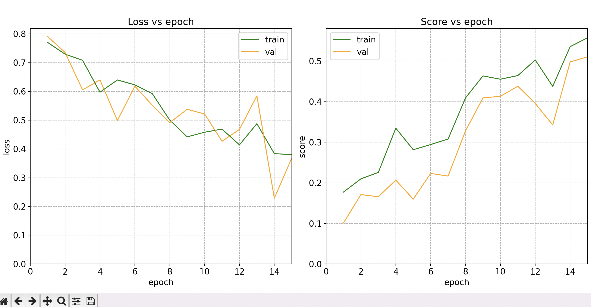
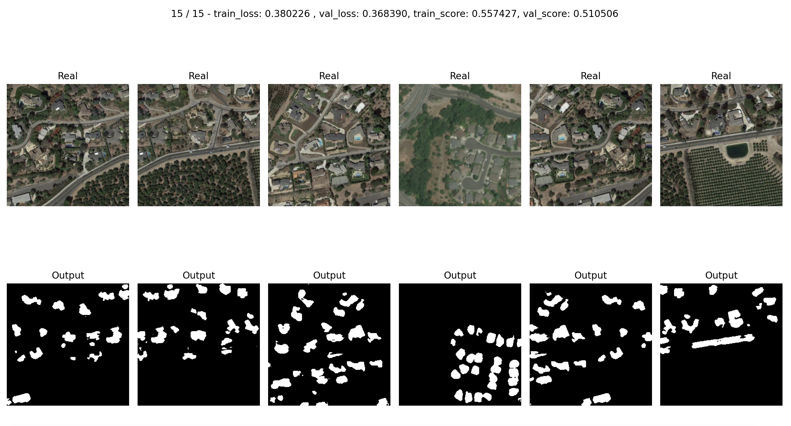

# Test task for satellite image segmentation

## Main:
1. test.py - train model
2. date - folder with source images needed for training. Put in root folder
https://drive.google.com/drive/folders/1Xramw9-FoM_4_Zz585dvvAWclXBWNXwx?usp=sharing

## Results: 
Loss chart at 15 epochs:

 
  

Results on validation img:

 
  

